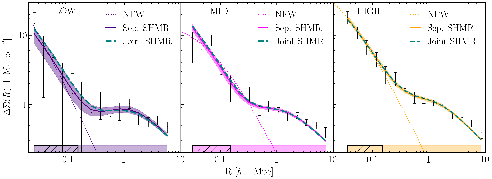
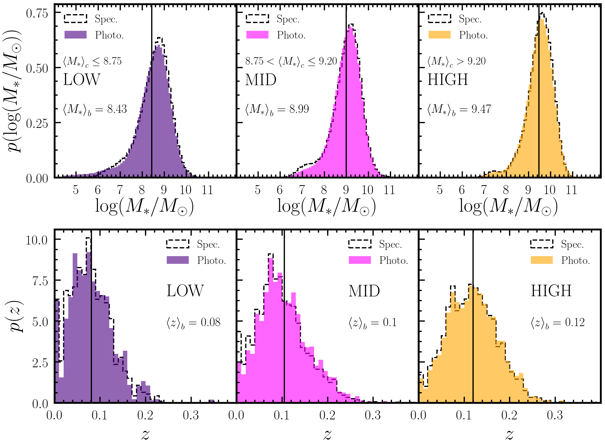

# Dwarf-Lensing
Measurements of stacked weak lensing halo mass profiles of dwarf galaxies, as published in [Thornton, Amon, Wechsler et al. 2023](https://arxiv.org/abs/2311.14659).

An example notebook,  
> example.ipynb  
>
is provided for clarity.

## Measurements
We share the galaxy-galaxy lensing measurements for each of the three low-mass samples, LOW, MID, and HIGH. They are saved as:  
>
> *_measurements.csv
>
Each file is arranged as:  

|$R \,[h^{-1} \rm{Mpc}]$|$\Delta\Sigma(R)\,[h\,M_\odot\rm{pc}^{-2}]$ |$\sigma(\Delta\Sigma(R))\,[h\,M_\odot\rm{pc}^{-2}]$|
|:-:|:-:|:-:|
|..|..|..|

These files contain data shown in the black data points and associated errors of the figure below (Figure 7 from [Thornton, Amon, Wechsler et al. 2023](https://arxiv.org/abs/2311.14659)).  

## Covariance Matrices 
We also share the covariance matrices for each sample, saved as  
>
> *_cov.csv  
>
The covariances matrices were produced with the Jackknife covariance estimation method, with $n=150$ Jackknife patches, and $p=15$ datapoints.
If you wishes to match our use of the inverse covariances you should employ the Hartlap correction
([Hartlap et al. 2007](https://ui.adsabs.harvard.edu/abs/2007A&A...464..399H)) to produce and unbiased estimate of the inverse covariance matrix.  
For our jackknife estimated covariance $C_*$:
$$C^{-1} = \frac{n-p-2}{n-1}C^{-1}_*$$

## Distributions
We also provide our log stellar mass, $\log_{10}({M_*/M_\odot})$, and redshift, $z$, distributions as  
>
> log_sm_distrb.csv  
>
and
>
> z_distrb.csv
>
respectively.  
Each file is arranged as  

|Bin Centres|LOW Weights|MID Weights|HIGH Weights|
|:-:|:-:|:-:|:-:|
|..|..|..|..|
 
All bins are of a fixed width in either $\log_{10}({M_*/M_\odot})$ or $z$ space, so if you wish to produce the bins manually, the bin edges are defined by:

$\log_{10}({M_*/M_\odot})$ : $[4.4, 11.9]$, $\Delta = 0.1$  
$z$ : $[0.0, 0.4]$, $\Delta = 0.01$  

The distributions are those coloured in the figure below (Figure 5 from [Thornton, Amon, Wechsler et al. 2023](https://arxiv.org/abs/2311.14659)).  

